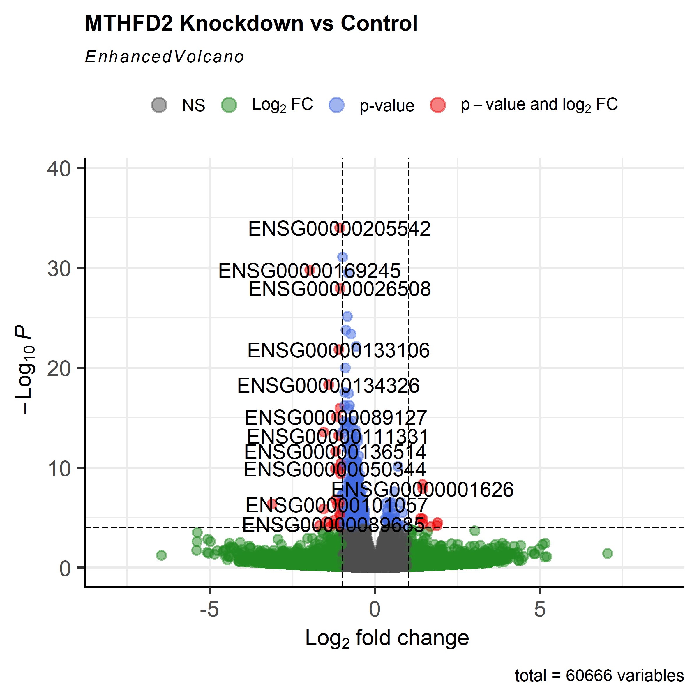
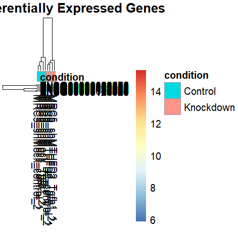

🧬 MTHFD2 调控纤维化生态位的 RNA-seq 差异表达分析本项目基于公共数据集 GSE313754 (PRJNA1381530)，利用 R 语言和 DESeq2 工具包，探索了 MTHFD2 基因敲低（Knockdown）后对肺癌相关成纤维细胞基因表达谱的影响。

📊 项目背景MTHFD2 在多种癌症中高表达，并与代谢重塑密切相关。本项目通过分析 8 个样本（4个 Control vs 4个 MTHFD2 KD），旨在识别受其调控的关键下游差异基因。

🛠 分析流程 (Bioinformatics Pipeline)
本项目涵盖了从原始数据获取到下游功能分析的全过程：
数据获取：从 NCBI SRA 数据库获取原始测序元数据。
预处理：使用 SRA Explorer 整理下载链接。
差异分析：利用 DESeq2 对 FPKM/Counts 矩阵进行标准化处理及差异倍数计算。
可视化：生成火山图与热图以直观展示显著差异基因。

📈 核心分析结果
1. 差异基因总览 (Volcano Plot)通过火山图，我们筛选出在 MTHFD2 敲低后显著上调和下调的基因。筛选标准：|log_2(FoldChange)| > 1且 p_{adj} < 0.05。
2. 样本聚类与表达模式 (Heatmap)展示了差异最显著的前 50 个基因。从热图中可以清晰看到对照组与实验组样本被完美区分，说明 MTHFD2 敲低引起了系统性的表达改变。
3. 
 📊 核心可视化成果展示
 | 1. 差异基因火山图 (Volcano Plot) | 2. 差异表达热图 (Heatmap) |
| :---: | :---: |
|  |  |
| 展示显著差异基因的分布 | 展示前 50 个显著基因的表达聚类 |

> **结果摘要**：
> - 本分析识别出在 MTHFD2 敲低后具有显著表达变化的基因（筛选标准：|log_2(FC)| > 1 且 P_{adj} < 0.05）。
> - **火山图**显示了大量显著上调（红色）和下调（绿色）的基因。
> - **热图**清晰展示了 4 个对照组样本与 4 个实验组样本的表达谱被完美区分，说明 MTHFD2 对细胞状态有显著调控作用。
